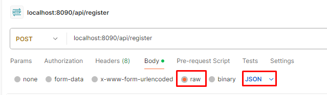
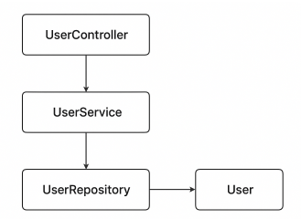

# Ejercicio API REST

## Cómo ejecutar

- Descargar el proyecto desde [GitHub](https://github.com/mscobar/ejercicio-java)
- Descomprimir en una carpeta dentro del escritorio.
- Abrir el proyecto descomprimido desde algún IDE ([IntelliJ](https://www.jetbrains.com/idea/download/?section=windows), [Eclipse](https://www.eclipse.org/downloads/), etc.)
- Ejecutar como proyecto springboot.

## Cómo probar

- Descargar e instalar [Postman](https://www.postman.com/downloads/)
- Abrir Postman
- Seleccionar el metodo post 
  - 
- Pegar la siguiente URL en la zona de texto localhost:8090/api/register
- En la pestaña body seleccionar la opcion raw en conjunto con JSON
  - 
- Para probar un caso exitoso pegar el siguiente JSON
  - {
    "name": "Juan Rodriguez",
    "email": "juan@rodriguez.org",
    "password": "Hunter123",
    "phones": [
    {
    "number": "1234567",
    "citycode": "1",
    "contrycode": "57"
    }
    ]
    }
- Para probar un caso de email duplicado, volver a ejecutar la peticion con el mismo JSON anterior.
- Para un caso de email incorrecto, ejecutar el siguiente JSON
  - {
    "name": "Juan Rodriguez",
    "email": "juanrodriguez.org",
    "password": "Hunter123",
    "phones": [
    {
    "number": "1234567",
    "citycode": "1",
    "contrycode": "57"
    }
    ]
    }
- Para un caso de password erronea, ejecutar con el siguiente JSON (valida que la password contenga mayúscula y numeros)
  - {
    "name": "Juan Rodriguez",
    "email": "juan@rodriguez.org",
    "password": "hunter",
    "phones": [
    {
    "number": "1234567",
    "citycode": "1",
    "contrycode": "57"
    }
    ]
    }
- La aplicación esta integrada de igual manera con Swagger para lo cual se debe acceder mediante navegador a la siguiente URL al momento de encender el proyecto http://localhost:8090/swagger-ui/index.html
- Para probar desde Swagger se deben utilizar los mismo JSON anteriores para obtener respuestas existosas o erroneas.

## Diagrama de la aplicación

